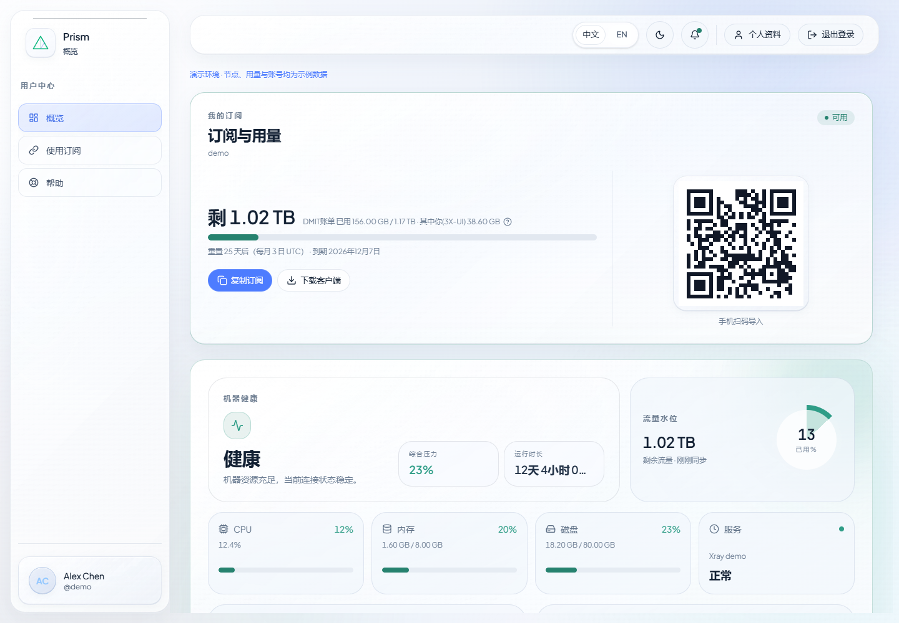
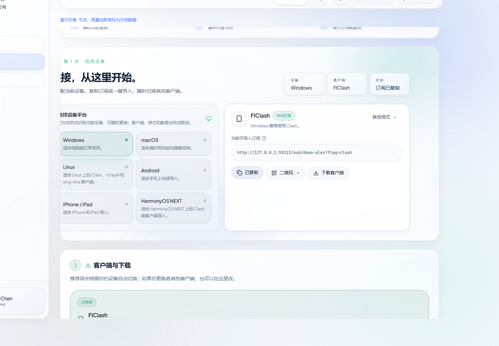
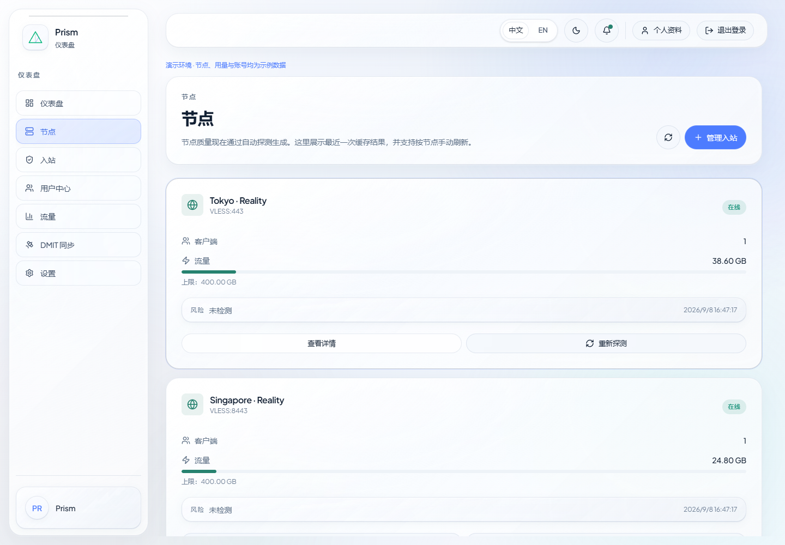
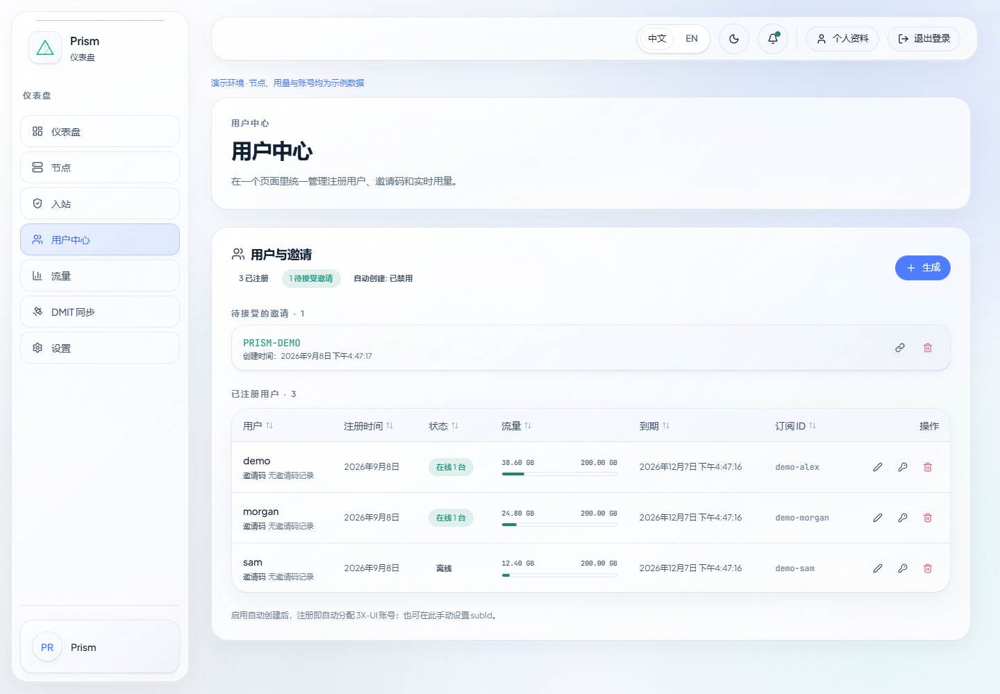
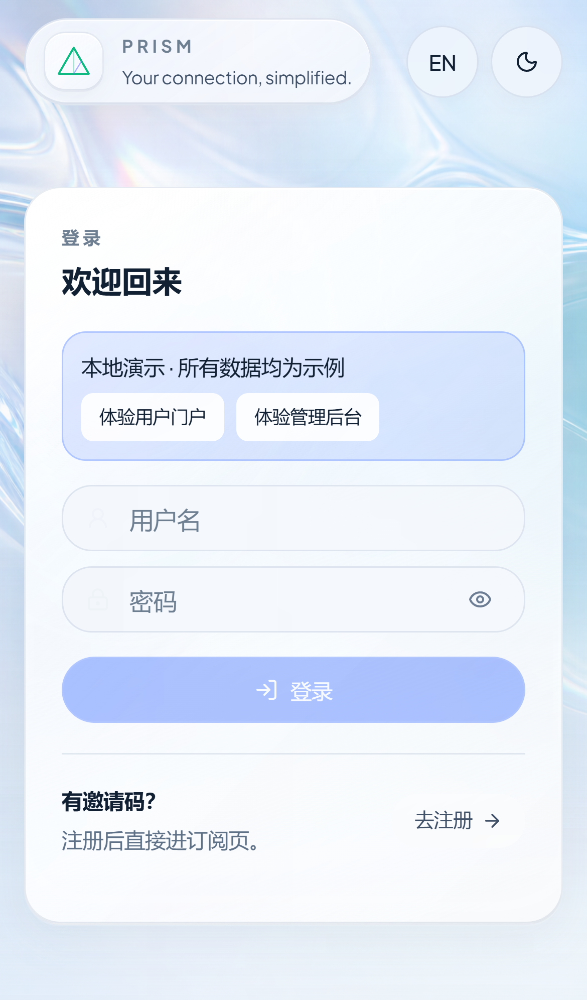
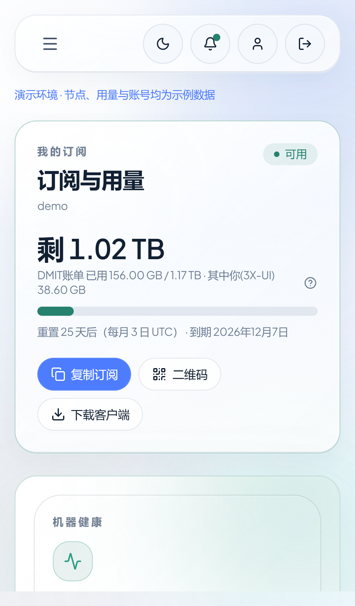
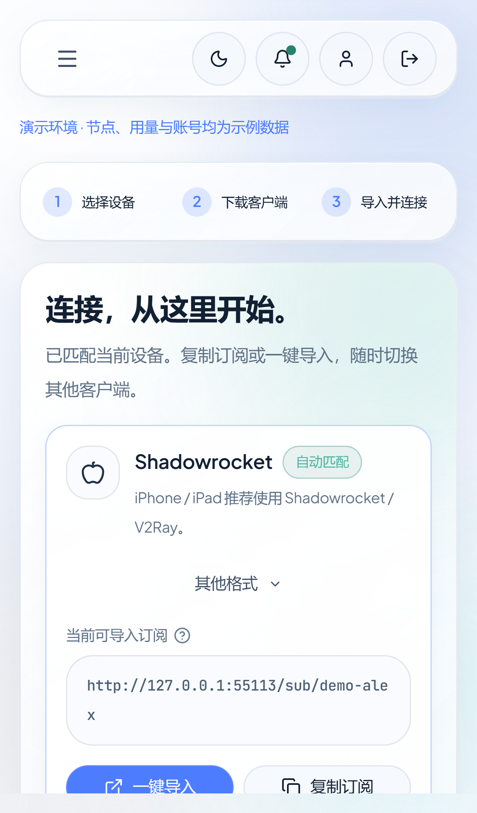

<p align="center"></p>
<h1 align="center">Prism · DMITProxy</h1>
<p align="center">一个清晰、轻量的 3X-UI 管理后台与邀请制订阅门户。</p>
<p align="center">
  <a href="LICENSE"></a>
  <a href="https://github.com/Johnny-dot/DMITProxy/actions/workflows/ci.yml"></a>
  
</p>
<p align="center">简体中文 · <a href="README.en.md">English</a> · <a href="docs/GETTING_STARTED.md">完整运行指南</a> · <a href="docs/DEPLOYMENT.md">部署</a> · <a href="docs/ARCHITECTURE.md">架构</a></p>


Prism 将管理员和终端用户的常用操作放在同一个应用中：管理员管理节点、账户、邀请码与流量；用户查看订阅、选择客户端、复制或导入链接，并获取使用帮助。

它使用 React、TypeScript、Express 与 SQLite，可部署为一个 Node.js 服务。3X-UI 是独立上游；DMIT 流量同步和节点探测是可选能力。项目并非 3X-UI 或 DMIT 官方产品。

## 先在本机体验

需要 Node.js 22.12+，推荐 **Node.js 24 LTS**。演示模式无需 `.env`、3X-UI 账号、Xray 或云服务器。

```bash
git clone https://github.com/Johnny-dot/DMITProxy.git
cd DMITProxy
npm ci
npm run demo
```

打开 **http://127.0.0.1:4173**。登录页有演示账户填充按钮：

| 身份     | 用户名  | 密码              |
| -------- | ------- | ----------------- |
| 用户门户 | `demo`  | `prism-demo-2026` |
| 管理后台 | `admin` | `prism-demo-2026` |

也可用邀请码 `PRISM-DEMO` 注册新演示用户。新用户先显示“准备中”，管理员可在用户中心绑定示例订阅 ID。

演示使用独立的系统临时目录，每次启动生成新数据。所有节点、用量与探测状态都是示例，不能作为真实代理使用。仅监听回环地址，不读取项目 `.env`；外部探测、镜像下载与流量同步在演示模式下禁用。按 `Ctrl+C` 停止。

## 可以做什么

| 用户门户                                     | 管理后台                       |
| -------------------------------------------- | ------------------------------ |
| 邀请注册、本地登录、管理员签发的密码重置链接 | 通过 3X-UI 管理员凭据登录      |
| 查看订阅状态、个人流量和机器流量口径         | 节点、入站、系统资源与流量看板 |
| 根据设备选择客户端与订阅格式                 | 用户、邀请码与订阅绑定管理     |
| 复制订阅、二维码、支持的客户端一键导入       | 公告、共享资源、社群入口配置   |
| 客户端下载入口与分步导入教程                 | 账期设置与可选 DMIT 流量同步   |
| 中文/英文、浅色/深色、移动端布局             | 可选的真实代理出口探测         |

订阅输出包括通用协议链接、Clash、sing-box 与 Surge。Clash 和 sing-box 由应用内置转换；Surge 需要额外安装 subconverter。客户端兼容性受协议、传输和内核版本影响，详见[运行指南](docs/GETTING_STARTED.md)。

## 实际运行图

以下图片通过仓库里的浏览器脚本，从**真实运行的本地演示程序**截取。画面使用示例账户和模拟上游数据，不包含生产账号、真实订阅或云服务凭据。移动端图片为浏览器设备模拟。

### 用户门户



### 订阅设置：主操作提前，教程按设备联动



### 节点与用户管理




### 移动端

<p>
  
  
  
</p>

更多图片：[桌面登录](docs/images/login-desktop.png) · [帮助中心](docs/images/help-desktop.png) · [英文深色界面](docs/images/admin-dark.png)。

重新生成截图：

```bash
npm run pw:install
npm run demo:screenshots
```

脚本自动启动隔离演示并在结束后关闭。Windows 未安装 Playwright Chromium 时，会尝试本机 Edge。截图默认输出到 `docs/images/`，验证记录同目录生成且不提交到 Git。

## 连接自己的 3X-UI

1. 按[完整运行指南](docs/GETTING_STARTED.md)安装依赖并复制 `.env.example`。
2. 填写上游地址、面板路径及服务账号。管理员登录使用 3X-UI 账号；普通用户使用本地邀请制账号。
3. 分别启动 API 和前端：

```bash
# 终端 1
npm run server
```

```bash
# 终端 2
npm run dev
```

前端为 `http://127.0.0.1:3000`，API 默认监听 `127.0.0.1:3001`。开发默认仅本机访问；确需可信局域网访问时使用 `npm run dev:lan` 并配置网络边界。

最小配置示例：

```dotenv
SERVER_HOST=127.0.0.1
SERVER_PORT=3001
VITE_3XUI_SERVER=https://panel.example.com
VITE_3XUI_BASE_PATH=/your-panel-path
VITE_SUB_URL=https://prism.example.com
XUI_ADMIN_USERNAME=your-service-account
XUI_ADMIN_PASSWORD=replace-with-your-own-password
XUI_AUTO_CREATE_ON_REGISTER=true
```

完整变量见 [`.env.example`](.env.example)。`PUBLIC_NODE_HOST` 应指向实际代理节点，它与网站和面板域名可以不同。不要把真实配置提交到 Git。

## 生产运行

```bash
npm ci
npm run ci:verify
```

`ci:verify` 包含构建。然后使用 `NODE_ENV=production npm start`（Linux/macOS），或在 PowerShell 中设置 `$env:NODE_ENV='production'` 后执行 `npm start`。Node 服务会托管 `dist/`，无需单独启动 Vite。

生产环境需要 HTTPS 反向代理、受保护的 `.env`、独立数据备份和上游访问控制。默认回环监听可由反向代理访问，容器或明确受控网络可通过 `SERVER_HOST` 调整。

详细的 Linux、PM2、反向代理、备份和发布说明见[部署指南](docs/DEPLOYMENT.md)。仓库包含自动部署工作流，配置生产 Secrets 前请先阅读触发条件。

## 开发与验证

```bash
npm run test          # 单元与 API 集成测试
npm run lint          # 代码与分层依赖检查
npm run typecheck     # TypeScript
npm run build         # 生产构建
npm run ci:verify     # 上述四项
npm run test:e2e      # 隔离演示与浏览器流程，证据写入 output/e2e
```

CI 使用 Node.js 24、锁文件安装、单元/API 测试、类型检查、构建和浏览器检查。首次浏览器测试前运行 `npm run pw:install`；Linux 可执行 `npx playwright install --with-deps chromium`。

```text
src/                 React 页面、组件、API 适配、主题与国际化
server/              Express、SQLite、3X-UI 通信和订阅转换
scripts/demo/        本地演示与截图/浏览器验证
scripts/deploy/      自托管部署脚本
docs/                运行、部署、架构与实际截图
data/                运行数据（Git 忽略）
```

## 当前边界与后续计划

当前适合自托管和小规模邀请制使用。节点探测依赖真实 Xray 环境；下载镜像依赖外网；网站截图和模拟上游测试不证明真实代理出口可用。

上游请求已有超时与认证恢复，账期失败任务会记录阶段并重试，备份使用在线一致性快照；主分支 CI 通过后自动部署对应提交，失败时恢复上一份应用。写入结果不明的账期任务需管理员核对，详见[可靠性说明](docs/RELIABILITY.md)。更多内核、物理设备和容量测试仍在后续计划中。

## 参与与许可证

欢迎提交可复现的问题和小范围改进，开始前请阅读[贡献指南](CONTRIBUTING.md)。安全问题按[安全说明](SECURITY.md)私下报告。

项目原创代码按 [MIT License](LICENSE) 开源。第三方软件、字体、品牌标识和客户端截图保留各自权利，见[第三方说明](THIRD_PARTY_NOTICES.md)。`package.json` 的 `private: true` 用于防止误发布到 npm，不影响 GitHub 开源。
