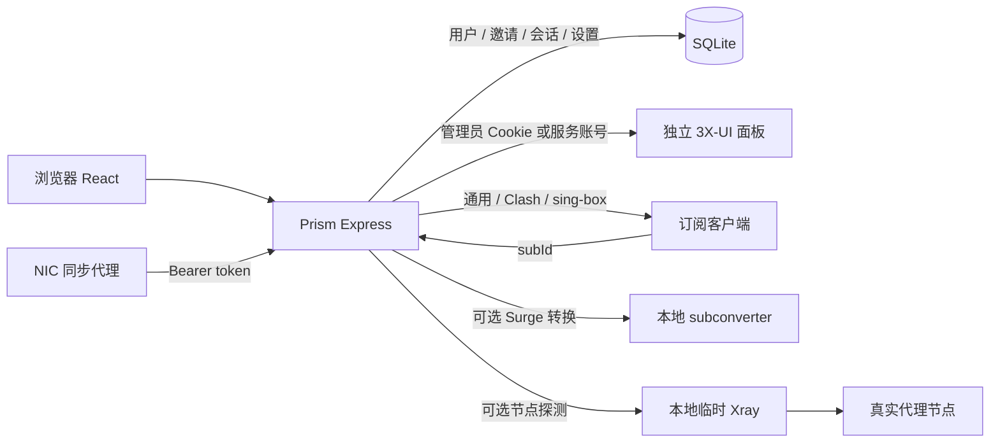
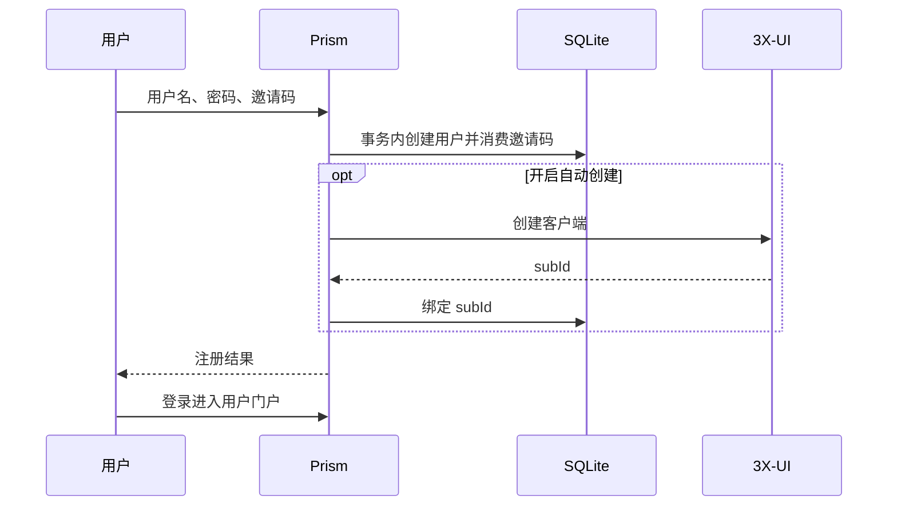

# 架构与运行流程

Prism 为单机 Web 应用。React 负责页面，Express 提供本地 API、上游代理和订阅输出，SQLite 保存本地业务状态。

## 身份与数据

| 身份/数据      | 位置                            | 说明                         |
| -------------- | ------------------------------- | ---------------------------- |
| 管理员会话     | 浏览器 3X-UI Cookie + 上游      | 不使用本地管理员密码         |
| 普通用户       | SQLite users                    | 邀请注册，密码 scrypt+盐     |
| 用户会话       | 浏览器 pd_session + SQLite 哈希 | 过期或密码重置后失效         |
| 邀请/重置链接  | SQLite                          | 重置令牌哈希保存，管理员签发 |
| 客户端与流量   | 3X-UI                           | 本地用户通过 subId 关联      |
| 设置/公告/资源 | SQLite app_settings             | 管理员修改                   |
| DMIT 快照      | SQLite dmit_traffic             | 与应用层统计区分来源         |

## 用户注册

普通异常有回滚逻辑。跨进程中断和“上游成功、响应丢失”的恢复仍需持久化对账。

## 演示环境

scripts/demo/runtime.ts 不调用生产入口，不加载 .env。先启动本地模拟 3X-UI，再为真实 Express app 设置独立 DATA_DIR，最后创建回环 Vite 前端。演示操作只影响临时数据。

模拟状态在页面上明确标注。节点使用 example.invalid 和文档地址；外部探测、镜像下载、DMIT 写入与需边车的转换在入口处拦截。演示不是代理服务。

## 分层

- src/types：共享类型。
- src/api、src/utils：接口适配与前端业务函数。
- src/pages、src/components、src/context：页面、交互、主题与身份状态。
- server：路由、存储、订阅和上游通信。
- scripts/demo：独立演示和浏览器验证，生产入口不导入。

## 后续改进

本轮完成 UI 层次整理、演示隔离、浏览器基础回归、订阅默认选择修正、客户端去重、依赖更新和回环默认监听。后续优先处理：

1. 统一 XUI 传输层，完整截止时间、响应体上限及认证恢复。
2. 账期重置的持久化状态、失败重试和跨日补偿。
3. SQLite 在线备份、恢复验证和独立保留策略。
4. 部署绑定通过验证的 SHA/产物，增加回滚并消除未版本化生产补丁依赖。
5. 在已补齐登录限流与注册类型校验的基础上，扩展请求 schema、受信代理配置与审计日志。
6. 拆分大型页面，提高组件及错误状态覆盖。
7. 扩展代理内核、物理设备和真实网络兼容性记录。

网站运行、模拟测试、真实出口探测和生产部署是不同证据范围，发布记录应分别报告。
