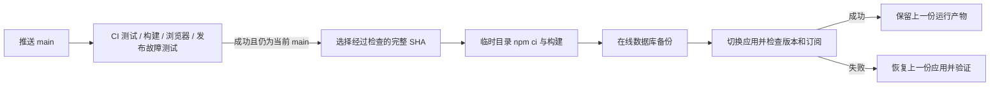

# 可靠性与故障恢复

## 上游通信

- XUI_REQUEST_TIMEOUT_MS 默认 15000ms，覆盖连接、响应体、重定向和路径回退的整个 HTTP 交换；XUI_MAX_RESPONSE_MB 默认 16。
- 代理连接中断、响应截断或超限会终止上游请求，释放资源。
- 明确认证失效后，只读服务请求共享一次重新登录并重试一次。普通浏览器代理不注入后台服务账号。
- 统计快照并发请求合并；写操作会使缓存失效，旧的在途结果不能回填新缓存。
- 管理员校验缓存最多 512 项，键为 Cookie 哈希，并按 TTL 清理；上游不可用返回可用性错误，不缓存为错误密码。
- TRUST_PROXY 默认 loopback，仅受信代理的转发头影响客户端 IP。请求来自不受信地址时，伪造 X-Forwarded-For 不能绕过限流或模拟内部回环来源。

## 账期任务

到达配置的 UTC 账期日时，先记录 xui_billing_reset_jobs，再执行聚合计数与客户端计数两步重置。聚合重置确认后立即记录阶段，后续客户端重置失败不会再次清空已确认的聚合计数。

明确失败按 1、2、4、8、15 分钟退避重试。已记录任务能跨 UTC 日期或进程重启恢复；未记录过的历史账期不会在首次升级时被追溯执行。更改/删除账期会取消对应待办，新账期会取代尚未完成的旧账期。

**网络失败等导致写入结果不明时，任务标记 requiresReview，不自动重放。** 管理员应先检查上游实际计数，再通过已登录的管理 API确认：

写入前先持久化保护标记，以覆盖进程在请求途中退出的情况；正常执行期间 inFlight=true，不能人工确认该任务。进程重启后，未得到明确结果的写入保留为待核对状态。此调度器按单个 Node/PM2 实例运行设计。

```text
GET /local/admin/xui-inbounds-billing
POST /local/admin/xui-inbounds/:id/billing-reset/review
body: { "cycleDate": "YYYY-MM-DD", "decision": "retry | aggregate-done | complete" }
```

- retry：确认需要重新执行未确认阶段。
- aggregate-done：确认聚合步骤已经完成，只继续客户端步骤。
- complete：确认两步已完成，仅记录完成，不再次发送重置请求。

这些操作需要真实管理员会话。远端系统与本地 SQLite 没有分布式事务；不能把网络超时简单当作远端没有执行。错过整个账期日且未产生任务记录时，需要人工核对；该版本不声称能重建丢失的历史计费数据。

## 备份

createDatabaseBackup 使用 SQLite Online Backup API，从 WAL 中获取一致快照。只在 quick_check 通过并完成原子改名后返回成功。文件权限在支持的系统上设置为 0600，失败的临时文件会清理。

本地备份解决一致性问题，异地复制、保留策略和灾难恢复仍需要部署方安排。发布失败恢复应用文件时，不会自动覆盖运行数据库。

## 发布



workflow_run 按前一个工作流的完成状态触发，部署显式检查 conclusion、仓库、分支及 SHA；不消费来自不受信 PR 的构建产物。[GitHub 工作流事件文档](https://docs.github.com/en/actions/reference/workflows-and-actions/events-that-trigger-workflows#workflow_run)

远端脚本使用主机锁，拒绝脏 checkout、分叉/过时版本及包含运行数据路径的候选。安装与构建失败不会清空正在使用的依赖。切换后失败会恢复此前代码、依赖与 dist，且保持部署任务失败状态。它不会通过杀死未知端口进程来获得一个表面健康结果。

## 验证范围

单元/API 测试覆盖响应体挂起、截断、取消、认证恢复、缓存竞态、WAL 并发备份、跨日账期恢复与不确定写入。Linux 发布故障测试在独立临时 Git 仓库中模拟 npm/PM2/HTTP，验证成功、幂等、安装/构建/备份失败、启动/订阅检查失败回滚、脏工作区和过时版本；它不会控制真实生产服务。

真实上线还要检查进程版本、公开入口、数据库和订阅生成。代理内核连通性及物理设备性能另行验证，不能由这些检查推断。
