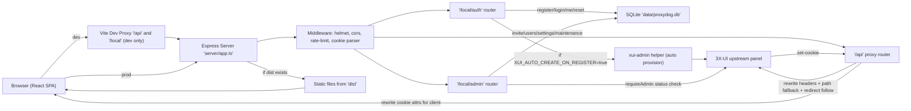
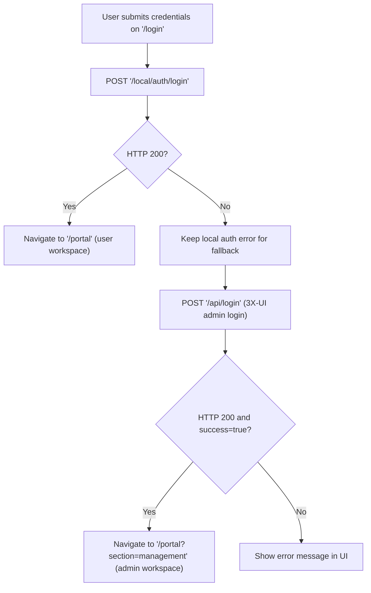
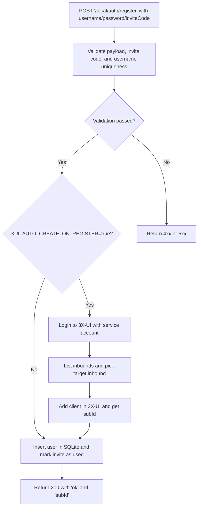

# ProxyDog System Flow

## 1) End-to-End Request Flow

```mermaid
flowchart LR
  U["Browser (React SPA)"]
  V["Vite Dev Proxy '/api' and '/local' (dev only)"]
  E["Express Server 'server/app.ts'"]
  M["Middleware: helmet, cors, rate-limit, cookie parser"]
  A["'/local/auth' router"]
  D["'/local/admin' router"]
  P["'/api' proxy router"]
  DB["SQLite 'data/proxydog.db'"]
  XA["xui-admin helper (auto provision)"]
  X["3X-UI upstream panel"]
  S["Static files from 'dist'"]

  U -->|"dev"| V --> E
  U -->|"prod"| E

  E --> M
  M --> A
  M --> D
  M --> P

  A -->|"register/login/me/reset"| DB
  A -->|"if XUI_AUTO_CREATE_ON_REGISTER=true"| XA --> X

  D -->|"requireAdmin status check"| X
  D -->|"invite/users/settings/maintenance"| DB

  P -->|"rewrite headers + path fallback + redirect follow"| X
  X -->|"set-cookie"| P -->|"rewrite cookie attrs for client"| U

  E -->|"if dist exists"| S --> U
```

## 2) Unified Login Decision Flow

```mermaid
flowchart TD
  Start["User submits credentials on '/login'"]
  LocalTry["POST '/local/auth/login'"]
  LocalOK{"HTTP 200?"}
  ToUser["Navigate to '/portal' (user workspace)"]
  LocalFail["Keep local auth error for fallback"]
  AdminTry["POST '/api/login' (3X-UI admin login)"]
  AdminOK{"HTTP 200 and success=true?"}
  ToAdmin["Navigate to '/portal?section=management' (admin workspace)"]
  LoginFail["Show error message in UI"]

  Start --> LocalTry --> LocalOK
  LocalOK -->|"Yes"| ToUser
  LocalOK -->|"No"| LocalFail --> AdminTry --> AdminOK
  AdminOK -->|"Yes"| ToAdmin
  AdminOK -->|"No"| LoginFail
```

## 3) User Registration and Auto Provision Flow

```mermaid
flowchart TD
  Req["POST '/local/auth/register' with username/password/inviteCode"]
  Validate["Validate payload, invite code, and username uniqueness"]
  Pass{"Validation passed?"}
  AutoSwitch{"XUI_AUTO_CREATE_ON_REGISTER=true?"}
  XLogin["Login to 3X-UI with service account"]
  PickInbound["List inbounds and pick target inbound"]
  AddClient["Add client in 3X-UI and get subId"]
  SaveUser["Insert user in SQLite and mark invite as used"]
  Ok["Return 200 with 'ok' and 'subId'"]
  Fail["Return 4xx or 5xx"]

  Req --> Validate --> Pass
  Pass -->|"No"| Fail
  Pass -->|"Yes"| AutoSwitch
  AutoSwitch -->|"No"| SaveUser
  AutoSwitch -->|"Yes"| XLogin --> PickInbound --> AddClient --> SaveUser
  SaveUser --> Ok
```
